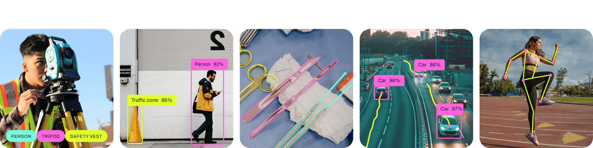

# Robovision

Copyright (c) 2024 Gilad Leef. All rights reserved. See LICENSE for more information.


## State-of-The-Art Computer Vision: Object Detection and Segmentation

Welcome to Robovision, a cutting-edge software collection designed for state-of-the-art computer vision applications, specifically focusing on real-time object detection and segmentation. Developed by Gilad Leef, this project leverages the YOLOv8 model and sophisticated algorithms to provide a simple yet powerful solution for diverse computer vision tasks.

## Introduction

In the ever-evolving landscape of computer vision, Robovision stands out as a comprehensive toolkit, offering a range of features and functionalities to meet the demands of modern applications. Whether you are a researcher, developer, or enthusiast, Robovision empowers you to harness the potential of deep learning in your projects.

## Features

- **Real-time Object Detection and Segmentation:** Robovision excels in providing accurate and efficient real-time object detection and segmentation capabilities, making it a versatile choice for various applications.

- **Out-of-the-Box Usage:** Get started quickly with pre-trained weights available from ultralytics or the open-source community. Robovision is ready to use, allowing you to dive into computer vision tasks without the need for extensive setup.

- **Fine-tuning and Pretraining:** Customize and enhance the model to suit your specific needs. Use the labelme tool for intuitive data labeling and leverage the datatool for seamless dataset format conversion, enabling you to fine-tune or pretrain new models effortlessly.

- **One-Click Dataset Generation:** Robovision simplifies the dataset generation process by supporting one-click creation from a single video file. This feature streamlines the data preparation phase, saving you valuable time and effort.

## Usage

To train the model, execute the following command:

```bash
python train.py
```

Training dependencies:

`pip install numpy ultralytics opencv-python torch`

Inference dependencies:

`pip install numpy onnxruntime opencv-python`

Optional tools:

`pip install labelme pynetworktables`

## Object Angle Calculation Formula

This document provides a simplified explanation of the angle calculation formula used in the script. The formula calculates the angle of each detected object based on its position relative to the center of the frame.

## Object Center Coordinates

The coordinates of the center of the detected object are calculated as follows:

```math
O_x = \frac{\text{box}[0] + \text{box}[2]}{2}
O_y = \frac{\text{box}[1] + \text{box}[3]}{2}
```
## Angle calculation:
```python
 # Calculate angle from the center of the object to the center of the frame

delta_x = object_center_x - center_x
delta_y = object_center_y - center_y

# Calculate the deviation from the center of the screen
deviation = center_x - object_center_x
scaled_deviation = (deviation / (frame_width // 2)) * 256
```
