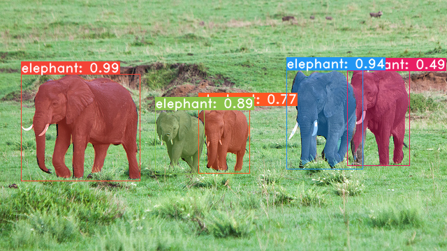

# robovision
### State-of-The-Art Computer vision: Object Detection and Segmentation

Robovision is a simple, yet powerful software collection that is based on the YOLOv8 model and algorithms.
Out-of-the-box usage is possible using the pretrained weights provided by ultralytics or the open-source community. 
To fine-tune or pretrain a new model, use the robolabel tool to label your data, and drag and drop your files into train/valid/test.

`python3 train.py`

Use labelme to easily label your data in a click of a button. 

Dependencies:

`pip install numpy onnxruntime opencv-python torch labelme`

## TODO
* check with the team what more stuff do we need
* Implement the more stuff we need
