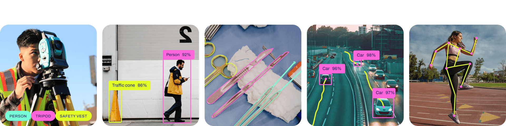

# Robovision

This software was originally written while I was in high school for the [Elysium 1937 FRC Team](https://github.com/elysium1937).

Copyright © 2024 Gilad Leef. All rights reserved. See `LICENSE` for more information.



## Computer Vision: Object Detection and Segmentation

Welcome to Robovision, a cutting-edge software collection designed for state-of-the-art computer vision applications, specifically focusing on real-time object detection and segmentation. Developed by Gilad Leef, this project leverages the YOLOv11 model and sophisticated algorithms to provide a simple yet powerful solution for diverse computer vision tasks.

## Introduction

In the ever-evolving landscape of computer vision, Robovision stands out as a comprehensive toolkit, offering a range of features and functionalities to meet the demands of modern applications. Whether you are a researcher, developer, or enthusiast, Robovision empowers you to harness the potential of deep learning in your projects.

## Features

* **Real-Time Object Detection and Segmentation:** Robovision provides accurate and efficient real-time object detection and segmentation capabilities, making it a versatile choice for various applications.

* **Out-of-the-Box Usage:** Get started quickly with pretrained weights available from Ultralytics or the open-source community. Robovision is ready to use, allowing you to dive into computer vision tasks without extensive setup.

* **Fine-Tuning and Pretraining:** Customize and enhance the model to suit your specific needs. Use Labelme for intuitive data labeling and the data tool for seamless dataset format conversion, enabling you to fine-tune or pretrain new models effortlessly.

* **One-Click Dataset Generation:** Robovision simplifies dataset generation by supporting one-click creation from a single video file. This feature streamlines the data preparation phase, saving valuable time and effort.

## Usage

To train the model, run:

```bash
python train.py
```

### Training Dependencies

```bash
pip install numpy ultralytics opencv-python torch
```

### Inference Dependencies

```bash
pip install numpy onnxruntime opencv-python
```

### Optional Tools

```bash
pip install labelme pynetworktables
```
